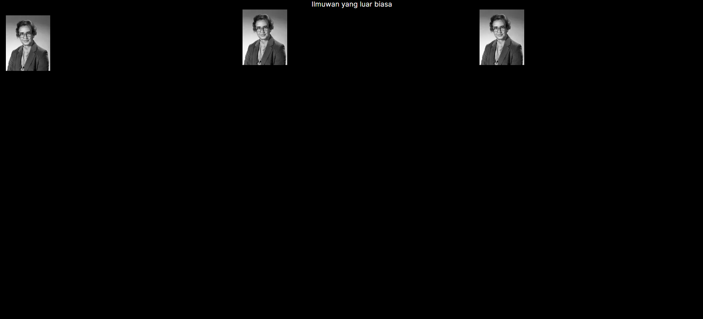
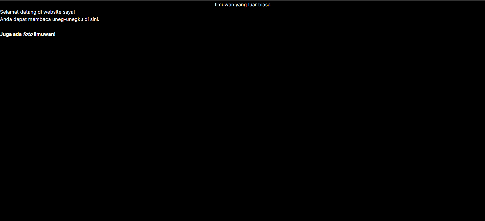
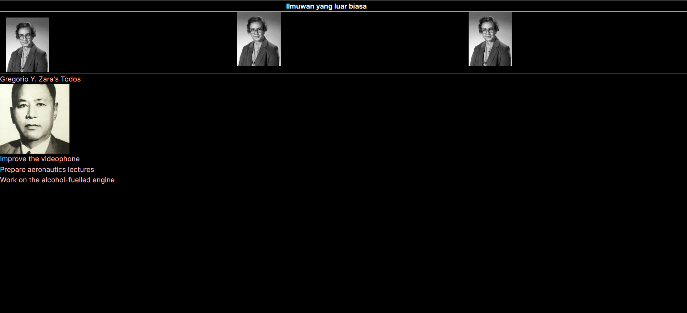
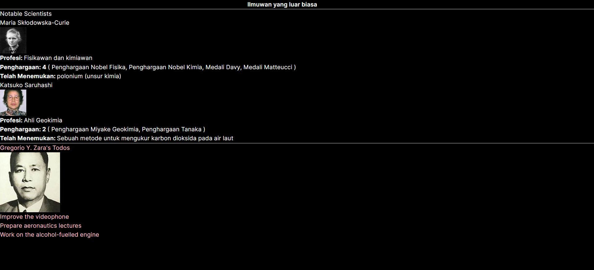
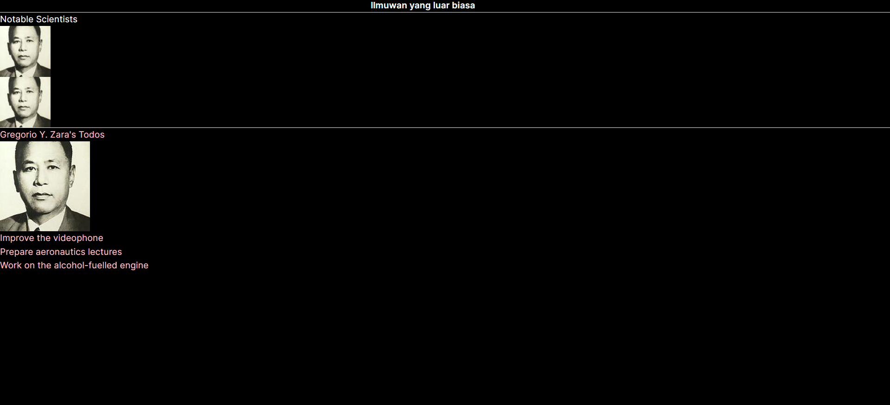

## Laporan Praktikum

|  | Pemrograman Berbasis Framework 2024 |
|--|--|
| NIM |  2141720031 |
| Nama |  Josafat Pratama Susilo |
| Kelas | TI - 3A |

### Jawaban Soal 1

Hal yang telah saya pelajari adalah:

- Ketika ingin menggunakan remote image dengan src berupa URL, perlu menyertakan height dan width. Hal tersebut berguna untuk menentukan rasio dari gambar
- Ketika ingin menggunakan remote image, perlu untuk melakukan setting pada file next.config.js atau next.config.mjs dan menambahkan domain dari gambar yang akan digunakan. Hal ini diperlukan untuk secara aman mengizinkan optimisasi gambar.

Cara saya untuk menyelesaikan error pada Soal 1 adalah menambahkan objek berikut:
```typescript
    images: {
        remotePatterns: [
            {
                protocol: 'https',
                hostname: 'i.imgur.com',
                port: '',
            },
        ],
    },
```

Di dalam nextConfig yang berada dalam next.config.mjs

Hasil dari soal 1 adalah sebagai berikut


### Jawaban Soal 2

Hal yang telah saya pelajari adalah terdapat 2 jenis import dan export komponen pada Next.js, yaitu:

- Named
- Default

Dalam melakukan export komponen pada next.js, kita hanya boleh menggunakan export default 1 kali saja per file, sedangkan untuk named export, kita dapat melakukan export sebanyak mungkin. Kita juga dapat menggabungkan named dan default export dalam 1 file.

Dalam menggunakan named export, ketika melakukan import, namanya harus sama dengan yang diexport. Sedangkan untuk default export, kita dapat memberikan nama apapun ketika melakukan import.

Hasil dari perubahan soal 2:



Terdapat sedikit perbedaan, namun hal ini hanya dikarenakan beda pendekatan layouting, jika pendekatan layouting sama, maka hasil tampilan akan sama.

### Jawaban Soal 3

Hasil dari perubahan soal 3 yang telah diperbaiki:


Yang telah saya pelajari adalah:
- Dalam sebuah komponen pada penulisan jsx, jika terdapat lebih dari 1 tag yang bertumpuk harus ada container yang membungkus tag-tag tadi
- Dalam penulisan jsx, setiap tag harus memiliki tag penutup
- Dalam penulisan jsx, class diubah menjadi className

Error yang terjadi pada soal 3 ada beberpa, yaitu:
- Tidak ada container yang membungkus tag-tag yang bertumpuk, saya menggunakan fragment untuk memperbaik error ini
- Penulisan class yang seharusnya className
- Tag <br> yang seharusnya memiliki tag penutup
- Penempatan tag penutup `<b>` dan `<i>` yang tidak pada tempatnya

### Jawaban Soal 4

Perbaikan untuk nomor 4 dilakukan dengan menambahkan dot/titik diikuti dengan key dari object yang ingin diakses. Dalam soal ini yaitu key name dari object person. Sehingga kode program akan menjadi seperti berikut
```javascript
<h1>{person.name}'s Todos</h1>
```

### Jawaban Soal 5

Hasil dari perubahan soal 5 yang url dari image telah diekstrak:


Tidak ada perbedaan pada tampilan website.


### Jawaban Soal 6

Yang saya pelajari dari soal tersebut adalah, untuk kita dapat mengakses langsung isi dari object dari dalam kurung kurawal dan menggabungkannya.

Berikut adalah hasil dari soal 6:


### Jawaban Soal 7

Yang telah saya pelajari adalah cara menggunakan props, yaitu dengan menambahkan props pada parameter dari komponen yang ingin diakses, kemudian di komponen akan diakses, diberi props dengan nama sesuai dengan komponen. Berikut hasil tampilan dari soal 7:


### Jawaban Soal 8

Yang telah saya pelajari adalah, kita bisa menggunakan ternary operator untuk melakukan pengecekan di dalam komponen jsx. Kemudian saya juga mempelajari cara menghandle props yang dikirim dari komponen lain. Berikut hasil tampilan dari soal 8:
