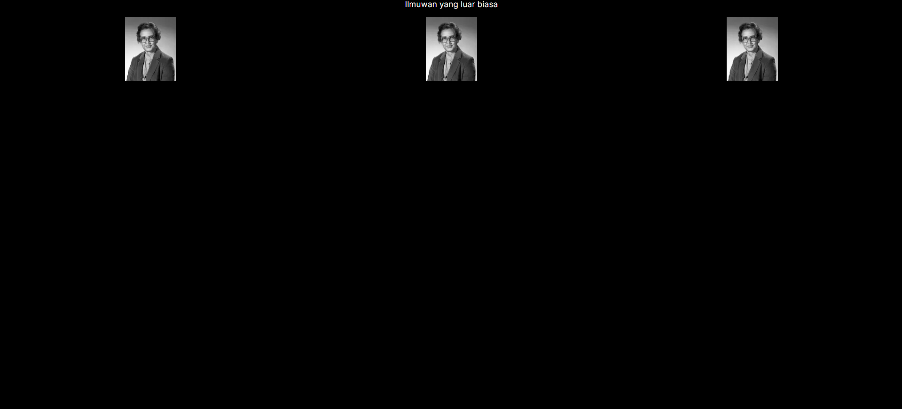

## Laporan Praktikum

|  | Pemrograman Berbasis Framework 2024 |
|--|--|
| NIM |  2141720031 |
| Nama |  Josafat Pratama Susilo |
| Kelas | TI - 3A |

### Jawaban Soal 1

Hal yang telah saya pelajari adalah:

- Ketika ingin menggunakan remote image dengan src berupa URL, perlu menyertakan height dan width. Hal tersebut berguna untuk menentukan rasio dari gambar
- Ketika ingin menggunakan remote image, perlu untuk melakukan setting pada file next.config.js atau next.config.mjs dan menambahkan domain dari gambar yang akan digunakan. Hal ini diperlukan untuk secara aman mengizinkan optimisasi gambar.

Cara saya untuk menyelesaikan error pada Soal 1 adalah menambahkan objek berikut:
```typescript
    images: {
        remotePatterns: [
            {
                protocol: 'https',
                hostname: 'i.imgur.com',
                port: '',
            },
        ],
    },
```

Di dalam nextConfig yang berada dalam next.config.mjs

Hasil dari soal 1 adalah sebagai berikut



### Jawaban Soal 2

Hal yang telah saya pelajari adalah terdapat 2 jenis import dan export komponen pada Next.js, yaitu:

- Named
- Default

Dalam melakukan export komponen pada next.js, kita hanya boleh menggunakan export default 1 kali saja per file, sedangkan untuk named export, kita dapat melakukan export sebanyak mungkin. Kita juga dapat menggabungkan named dan default export dalam 1 file.

Dalam menggunakan named export, ketika melakukan import, namanya harus sama dengan yang diexport. Sedangkan untuk default export, kita dapat memberikan nama apapun ketika melakukan import.

Hasil dari perubahan soal 2:


Terdapat sedikit perbedaan, namun hal ini hanya dikarenakan beda pendekatan layouting, jika pendekatan layouting sama, maka hasil tampilan akan sama.